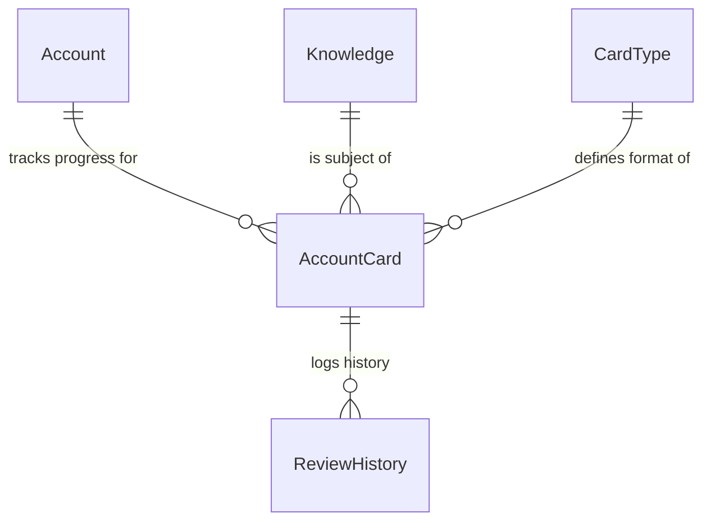

# System Architecture

## 1\. System Overview

### High-Level Design

The system is a full-stack web application built with **Next.js**, utilizing **Supabase** for the backend-as-a-service (BaaS) layer. It leverages Server-Side Rendering (SSR) and React Server Components (RSC) for performance, with a client-side Single Page Application (SPA) experience for interactive learning features.

### Key Components

*   **Framework**: Next.js 15+ (App Router).
*   **Database & Auth**: Supabase (PostgreSQL + GoTrue).
*   **Frontend**: React-based UI with Tailwind CSS and Radix UI.
*   **State Management**: TanStack Query for server state synchronization.

---

## 2\. Domain & Data Design

### 2.1 Database Schema

The database relies on PostgreSQL hosted by Supabase.

#### Core Tables

*   `knowledge`: The central content entity.
    *   `code` (PK): Immutable identifier (e.g., `ST-0000001`) generated via **Database Triggers**.
    *   `metadata` (JSONB): Flexible attributes.
*   `card_types`: Definitions of learning patterns.
*   `templates`: Rendering layouts linked to card types.
*   `accounts`: User identities (managed by Supabase Auth).
*   `account_cards`: Intersection of Account + Knowledge + CardType. Tracks SM-2 state.
*   `review_history`: Immutable log of all reviews for analytics.

#### ER Diagram (Conceptual)

### 2.2 Data Types & Standards

*   **Codes**:
    *   `ST`: Standard (default).
    *   `CS`: Case Study (Reserved for future).
    *   *Implementation*: Handled by PostgreSQL `BEFORE INSERT` triggers.
*   **Timestamps**: All stored in UTC (`TIMESTAMPTZ`).

---

## 3\. Application Architecture

### 3.1 Backend Layers (Next.js API Routes)

1.  **Route Handlers (**`src/app/api/`):
    *   Act as the API gateway.
    *   Authenticate users via `@supabase/ssr`.
    *   Execute business logic and return JSON responses.
2.  **Supabase Client (**`src/lib/supabaseServer.ts`):
    *   Handles secure, server-side database interactions.
    *   Manages cookie-based sessions.

### 3.2 Frontend Architecture

*   **Framework**: React + Vite (via Next.js) + TypeScript.
*   **State Management**: TanStack Query (React Query).
*   **UI Components**: Radix UI + Tailwind CSS (Shadcn-like structure).
*   **Auth**: Supabase Auth helpers for Next.js.

### 3.3 Learner Workflows

1.  **Daily Review**:
    *   **Endpoint**: `GET /api/accounts/me/cards/due`
    *   **Logic**: Queries `account_cards` where `next_review_date <= NOW()`.
2.  **Card Review**:
    *   **Endpoint**: `POST /api/cards/{id}/review`
    *   **Logic**: Updates SM-2 state (`ease_factor`, `interval`, `next_review_date`) based on user quality rating.

### 3.4 Operator Workflows

1.  **Knowledge Management**:
    *   **Direct Access**: Operators have write access to the `knowledge` table.
    *   **Import**: Bulk creation via CSV upload.
    *   **Endpoint**: `POST /api/knowledge` (Bulk/Single create).
    *   **Logic**:
        *   Accepts JSON payload of words.
        *   Performs `UPSERT` on the `knowledge` table.
        *   DB Triggers assign `code` for new entries.

---

## 4\. Key Design Patterns

### 4.1 Immutable Code Generation

*   **Mechanism**: Database Triggers.
*   **Logic**: On `INSERT`, if `code` is null, generate from a sequence (e.g., `ST-` prefix + sequence number).

### 4.2 Spaced Repetition (SM-2)

*   **Logic**: Implemented in API Route handlers (TypeScript).
*   **State**: Persisted in `account_cards`.

---

## 5\. Security & Access Control

### 5.1 Authentication

*   **Provider**: Supabase Auth.
*   **Mechanism**: JWT + Cookie Session.
*   **Roles**: Managed via `user_metadata` or separate `profiles` table logic (currently `user_metadata.role`).

### 5.2 Authorization

*   **RBAC**:
    *   `client`: Read-only access to content, Write access to own `account_cards`.
    *   `operator`: Write access to `knowledge` table.

---

## 6\. Deployment & Operations

*   **Platform**: Vercel (recommended for Next.js) or any Node.js/Docker environment.
*   **Database**: Supabase (Cloud or Self-hosted).
*   **Configuration**: Environment variables (`NEXT_PUBLIC_SUPABASE_URL`, etc.).