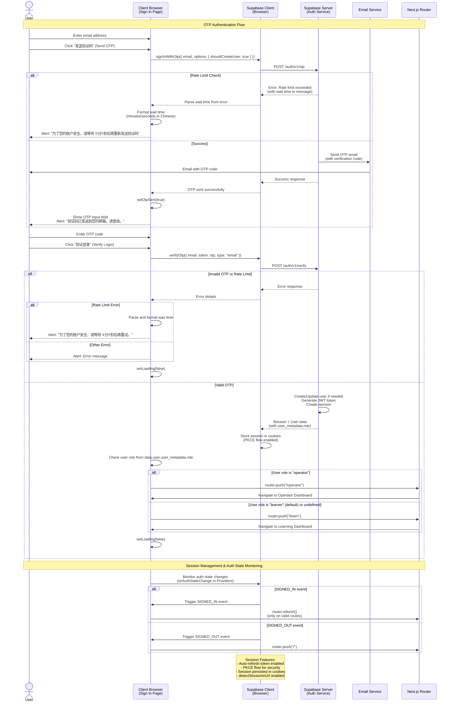

# Authentication Sequence Diagram

This document describes the authentication flow for the "背它一辈子" (Be It Forever) application.

## Authentication Flow

The application uses Supabase authentication with OTP (One-Time Password) via email verification code.

## Key Components

### Client-Side Authentication
- **Location**: `src/app/page.tsx`
- **Method**: Uses Supabase client (`createClient()`) for browser-based auth
- **Features**:
  - OTP request via `signInWithOtp()` with `shouldCreateUser: true` option
  - OTP verification via `verifyOtp()` with email, token, and type
  - Rate limiting error handling with user-friendly Chinese messages
  - Role-based redirect after successful authentication
  - "重新发送验证码" (Resend OTP) button to reset and request new OTP

### Session Management
- **Client**: `src/lib/supabaseClient.ts`
  - Uses PKCE flow for enhanced security
  - Auto-refreshes tokens
  - Detects session in URL
  - Persists session in cookies

- **Server**: `src/lib/supabaseServer.ts`
  - Route handlers can modify cookies
  - Server components are read-only
  - Middleware handles session refresh

### Auth State Monitoring
- **Location**: `src/app/providers.tsx`
- **Functionality**:
  - Monitors auth state changes via `onAuthStateChange()`
  - Handles `SIGNED_IN` and `SIGNED_OUT` events
  - Automatically redirects on sign-out
  - Refreshes router on sign-in

## User Roles

- **operator**: Content managers who access `/operator` dashboard
- **learner** (default): Regular users who access `/learn` dashboard

Role is determined by `user_metadata.role` in the Supabase user object.

## Security Features

1. **PKCE Flow**: Prevents authorization code interception attacks
2. **Rate Limiting**: Prevents OTP spam (handled by Supabase)
3. **Session Cookies**: Secure, HTTP-only cookies managed by Supabase
4. **Auto Token Refresh**: Maintains session without user intervention
5. **Role-Based Access**: Different dashboards based on user role

