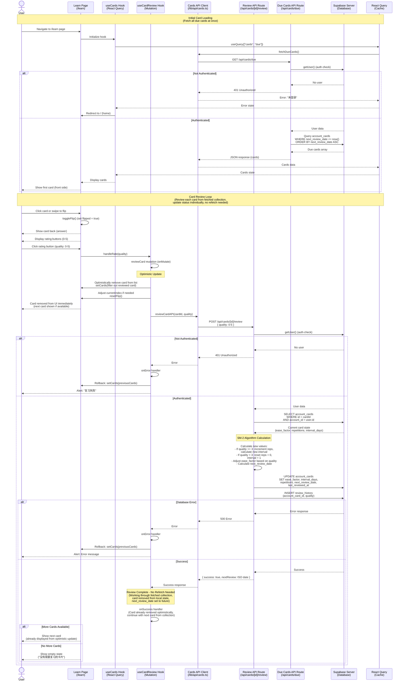

# Card Review Sequence Diagram

This document describes the card review flow for the "背它一辈子" (Be It Forever) application.

## Card Review Flow

The application uses the SM-2 spaced repetition algorithm (Anki implementation) to manage card reviews.

## Key Components

### Client-Side Card Management
- **Location**: `src/app/learn/page.tsx`
- **Hooks**:
  - `useCards`: Manages card fetching via React Query
  - `useCardReview`: Handles card review mutations with optimistic updates
  - `useCardFlip`: Manages card flip state
  - `useTouchSwipe`: Handles touch gestures for card flipping
  - `useSpeech`: Provides text-to-speech functionality

### Card Review Hook
- **Location**: `src/app/learn/hooks/useCardReview.ts`
- **Features**:
  - Optimistic UI updates (removes card immediately)
  - No refetch needed after review (card's `next_review_date` set to future, so it won't be in due query)
  - Error handling with rollback to previous state
  - Index management when cards are removed

### API Endpoints

#### Due Cards Endpoint
- **Route**: `GET /api/cards/due`
- **Location**: `src/app/api/cards/due/route.ts`
- **Functionality**:
  - Authenticates user
  - Queries `account_cards` table for cards where `next_review_date <= now()`
  - Orders by `next_review_date` ascending
  - Joins with `knowledge` table to get card content
  - Returns cards array

#### Review Endpoint
- **Route**: `POST /api/cards/[id]/review`
- **Location**: `src/app/api/cards/[id]/review/route.ts`
- **Functionality**:
  - Authenticates user
  - Fetches current card state from database
  - Applies SM-2 algorithm:
    - **Quality >= 3 (Correct)**: Increments repetitions, calculates new interval based on ease factor
    - **Quality < 3 (Incorrect)**: Resets repetitions to 0, sets interval to 1 day
    - Adjusts ease factor: `newEase += 0.1 - (5 - quality) * (0.08 + (5 - quality) * 0.02)`
    - Minimum ease factor: 1.3
  - Updates card with new values
  - Inserts review history record
  - Returns success with next review date

### SM-2 Algorithm Details

The implementation follows the Anki SM-2 algorithm:

1. **Initial Intervals**:
   - First review (reps = 0): 1 day
   - Second review (reps = 1): 6 days
   - Subsequent reviews: `interval * ease_factor`

2. **Ease Factor Adjustment**:
   - Formula: `ease += 0.1 - (5 - quality) * (0.08 + (5 - quality) * 0.02)`
   - Minimum value: 1.3
   - Higher quality ratings increase ease factor more

3. **Reset on Failure**:
   - When quality < 3, the card is reset to initial state
   - Repetitions = 0, interval = 1 day

### Database Schema

#### account_cards Table
- `id`: Card ID
- `account_id`: User ID (foreign key)
- `knowledge_code`: Knowledge item code
- `ease_factor`: Current ease factor (default ~2.5)
- `interval_days`: Current interval in days
- `repetitions`: Number of successful reviews
- `next_review_date`: Next scheduled review date
- `last_reviewed_at`: Timestamp of last review

#### review_history Table
- `account_card_id`: Foreign key to account_cards
- `quality`: Rating given (0-5)
- `created_at`: Timestamp of review

### Review Pattern: Batch Fetch, Individual Updates

The application follows a **batch fetch, individual update** pattern:

1. **Initial Fetch**: When the user navigates to the learn page, all due cards are fetched at once in a single query
2. **Review Session**: The user works through the fetched collection, reviewing cards one by one
3. **Individual Updates**: Each card review updates only that specific card's status in the database
4. **No Refetch**: After each review, the card is removed from the local state (optimistic update), and its `next_review_date` is set to the future, so it won't appear in future queries. No refetch is needed because:
   - The card is already removed from the local collection
   - The user continues with the remaining cards from the initial fetch
   - New cards that become due during the session will be fetched on the next page load

This pattern is efficient because:
- Reduces API calls (one fetch at start vs. refetch after each review)
- Provides immediate UI feedback (optimistic updates)
- Works through a consistent set of cards during a review session

### User Experience Flow

1. **Page Load**: Fetches and displays all due cards at once
2. **Card Display**: Shows card front (question) initially
3. **Flip Interaction**: User clicks/swipes to reveal answer
4. **Rating**: User selects quality rating (0-5)
5. **Optimistic Update**: Card immediately removed from view (next card shown)
6. **Background Processing**: API updates card state in database (sets `next_review_date` to future)
7. **Success**: Review confirmed (no refetch needed - card already removed, won't be due anymore)
8. **Next Card**: Next card already displayed from optimistic update, or empty state shown

### Error Handling

- **401 Unauthorized**: Redirects to home page
- **404 Not Found**: Card doesn't exist or doesn't belong to user
- **500 Server Error**: Shows error message, rolls back optimistic update
- **Network Error**: Shows error message, maintains previous state

### Performance Optimizations

1. **Optimistic Updates**: Immediate UI feedback without waiting for server
2. **React Query Caching**: Reduces unnecessary API calls
3. **No Refetch After Review**: Since reviewed cards have `next_review_date` set to future, they won't appear in due queries. The optimistic removal is sufficient.
4. **Index Management**: Automatically adjusts card index when cards are removed

