# Card Review Sequence Diagram

This document describes the card review flow for the "背它一辈子" (Be It Forever) application.

## Card Review Flow

The application uses the SM-2 spaced repetition algorithm (Anki implementation) to manage card reviews.

```mermaid
sequenceDiagram
    actor User
    participant LearnPage as Learn Page<br/>(/learn)
    participant useCards as useCards Hook<br/>(React Query)
    participant useCardReview as useCardReview Hook<br/>(Mutation)
    participant CardsAPI as Cards API Client<br/>(/lib/api/cards.ts)
    participant ReviewAPI as Review API Route<br/>(/api/cards/[id]/review)
    participant DueAPI as Due Cards API Route<br/>(/api/cards/due)
    participant SupabaseServer as Supabase Server<br/>(Database)
    participant ReactQuery as React Query<br/>(Cache)

    Note over User,ReactQuery: Initial Card Loading<br/>(Fetch up to 10 cards for today)

    User->>LearnPage: Navigate to /learn page
    LearnPage->>useCards: Initialize hook
    useCards->>ReactQuery: useQuery(["cards", "due"])
    ReactQuery->>CardsAPI: fetchDueCards()
    CardsAPI->>DueAPI: GET /api/cards/due

    DueAPI->>SupabaseServer: getUser() (auth check)
    alt Not Authenticated
        SupabaseServer-->>DueAPI: No user
        DueAPI-->>CardsAPI: 401 Unauthorized
        CardsAPI-->>ReactQuery: Error: "未登录"
        ReactQuery-->>useCards: Error state
        useCards->>LearnPage: Redirect to / (home)
    else Authenticated
        SupabaseServer-->>DueAPI: User data
        DueAPI->>SupabaseServer: COUNT account_cards<br/>WHERE last_reviewed_at is today
        SupabaseServer-->>DueAPI: Reviewed count
        alt Already Reviewed 10 Cards Today
            DueAPI->>DueAPI: Count >= 10
            DueAPI-->>CardsAPI: { reviewedCount: 10, cards: [] }
        else Under Daily Limit
            DueAPI->>DueAPI: Calculate remaining slots<br/>(10 - reviewedCount)
            DueAPI->>SupabaseServer: Query due cards<br/>WHERE next_review_date <= now()<br/>ORDER BY next_review_date ASC<br/>LIMIT remainingSlots
            SupabaseServer-->>DueAPI: Due cards array
            DueAPI->>DueAPI: Format response
            DueAPI-->>CardsAPI: { reviewedCount: <count>, cards: [due cards] }
        end
        CardsAPI-->>ReactQuery: { reviewedCount, cards }
        ReactQuery-->>useCards: DueCardsResponse
        useCards->>useCards: Extract reviewedCount and cards<br/>Mark cards as reviewed: false
        useCards-->>LearnPage: Cards array + reviewedCount
        LearnPage-->>User: Show first card (front side)
    end

    Note over User,ReactQuery: Card Review Loop<br/>(Review each card from fetched collection,<br/>update status individually, no refetch needed.<br/>Track cards reviewed today based on last_reviewed_at)

    User->>LearnPage: Click card or swipe to flip
    LearnPage->>LearnPage: toggleFlip() (set flipped = true)
    LearnPage-->>User: Show card back (answer)
    LearnPage-->>User: Display rating buttons (0-5)

    User->>LearnPage: Click rating button (quality: 0-5)
    LearnPage->>useCardReview: handleRate(quality)
    useCardReview->>useCardReview: reviewCard mutation (onMutate)

    Note over useCardReview: Optimistic Update

    useCardReview->>LearnPage: Mark card as reviewed today<br/>setCards(map card.reviewed = true,<br/>last_reviewed_at = now)
    useCardReview->>LearnPage: Navigate to next unreviewed card<br/>setCurrentIndex(next unreviewed index)<br/>resetFlip()
    useCardReview->>LearnPage: Update daily progress indicator<br/>(reviewed today count / total cards for today)
    LearnPage-->>User: Card marked as reviewed today<br/>(next unreviewed card shown,<br/>progress updated)

    useCardReview->>CardsAPI: reviewCardAPI(cardId, quality)
    CardsAPI->>ReviewAPI: POST /api/cards/[id]/review<br/>{ quality: 0-5 }

    ReviewAPI->>ReviewAPI: Check daily limit<br/>(count cards reviewed today)
    alt Already Reviewed 10 Cards Today
        ReviewAPI->>ReviewAPI: Count >= 10 and card not reviewed today
        ReviewAPI-->>CardsAPI: 403 Forbidden<br/>"今日已复习10张卡片，已达到每日限制"
        CardsAPI-->>useCardReview: Error
        useCardReview->>useCardReview: onError handler
        useCardReview-->>User: Toast: "今日已复习10张卡片，已达到每日限制"
    else Under Daily Limit
        ReviewAPI->>SupabaseServer: getUser() (auth check)
      alt Not Authenticated
          SupabaseServer-->>ReviewAPI: No user
          ReviewAPI-->>CardsAPI: 401 Unauthorized
          CardsAPI-->>useCardReview: Error
          useCardReview->>useCardReview: onError handler
          useCardReview->>LearnPage: Rollback: setCards(previousCards)
          useCardReview-->>User: Alert: "复习失败"
      else Authenticated
          SupabaseServer-->>ReviewAPI: User data

          ReviewAPI->>SupabaseServer: SELECT account_cards<br/>WHERE id = cardId<br/>AND account_id = user.id
          SupabaseServer-->>ReviewAPI: Current card state<br/>(ease_factor, repetitions, interval_days)

          Note over ReviewAPI: SM-2 Algorithm Calculation

          ReviewAPI->>ReviewAPI: Calculate new values:<br/>- If quality >= 3: increment reps,<br/>  calculate new interval<br/>- If quality < 3: reset reps = 0,<br/>  interval = 1<br/>- Adjust ease_factor based on quality<br/>- Calculate next_review_date

          ReviewAPI->>SupabaseServer: UPDATE account_cards<br/>SET ease_factor, interval_days,<br/>repetitions, next_review_date,<br/>last_reviewed_at = now()
          ReviewAPI->>SupabaseServer: INSERT review_history<br/>(account_card_id, quality)

          alt Database Error
              SupabaseServer-->>ReviewAPI: Error response
              ReviewAPI-->>CardsAPI: 500 Error
              CardsAPI-->>useCardReview: Error
              useCardReview->>useCardReview: onError handler
              useCardReview->>LearnPage: Rollback: setCards(previousCards)
              useCardReview-->>User: Alert: Error message
          else Success
              SupabaseServer-->>ReviewAPI: Success
              ReviewAPI-->>CardsAPI: { success: true, nextReview: ISO date }
              CardsAPI-->>useCardReview: Success response

              Note over useCardReview: Review Complete - No Refetch Needed<br/>(Working through fetched collection,<br/>card marked as reviewed today in local state,<br/>last_reviewed_at updated in DB,<br/>next_review_date set to future)

              useCardReview->>useCardReview: onSuccess handler<br/>(Card already marked as reviewed today optimistically,<br/>next unreviewed card already displayed)

              alt More Unreviewed Cards Available
                  LearnPage-->>User: Show next unreviewed card<br/>(already displayed from optimistic update,<br/>daily progress indicator shows reviewed today count)
              else All Cards Reviewed Today
                  LearnPage-->>User: Show completed state<br/>(all cards reviewed today)
              end
          end
      end
    end
```

## Key Components

### Client-Side Card Management

- **Location**: `src/app/learn/page.tsx`
- **Hooks**:
  - `useCards`: Manages card fetching via React Query
  - `useCardReview`: Handles card review mutations with optimistic updates
  - `useCardFlip`: Manages card flip state
  - `useTouchSwipe`: Handles touch gestures for card flipping
  - `useSpeech`: Provides text-to-speech functionality

### Card Review Hook

- **Location**: `src/app/learn/hooks/useCardReview.ts`
- **Features**:
  - Optimistic UI updates (marks card as reviewed today immediately)
  - Sets `last_reviewed_at` to current timestamp when card is reviewed
  - Navigates to next unreviewed card after review
  - Updates daily progress indicator with reviewed today count
  - No refetch needed after review (card's `next_review_date` set to future, so it won't be in due query)
  - Error handling with rollback to previous state
  - Index management to navigate to unreviewed cards

### Progress Indicator Component

- **Location**: `src/app/learn/components/ProgressIndicator.tsx`
- **Functionality**:
  - Displays **daily progress**: shows how many cards have been reviewed today out of total cards for today
  - Format: "x / y" where:
    - `x` = reviewed today count + 1 (starts from 1, e.g., "1 / 10" means starting first card)
    - `y` = total cards for today (up to 10, includes both due cards and cards already reviewed today)
  - Updates immediately when a card is reviewed (via optimistic update)
  - Persists across page refreshes within the same day

### API Endpoints

#### Due Cards Endpoint

- **Route**: `GET /api/cards/due`
- **Location**: `src/app/api/cards/due/route.ts`
- **Functionality**:
  - Authenticates user
  - **First**: Counts cards reviewed today using COUNT query
  - **If >= 10 reviewed today**: Returns `{ reviewedCount: 10, cards: [] }` (daily limit reached)
  - **If < 10 reviewed today**:
    - Calculates remaining slots: `10 - reviewedCount`
    - Queries `account_cards` table for due cards where `next_review_date <= now()`
    - Limits query to remaining slots
    - Orders by `next_review_date` ascending (earliest due first)
    - Joins with `knowledge` table to get card content
    - Returns `{ reviewedCount: <count>, cards: [due cards] }`
  - All returned cards are due cards (unreviewed), not cards already reviewed today
  - Response format is always consistent: `{ reviewedCount: number, cards: Card[] }`

#### Review Endpoint

- **Route**: `POST /api/cards/[id]/review`
- **Location**: `src/app/api/cards/[id]/review/route.ts`
- **Functionality**:
  - Authenticates user
  - **Enforces daily review limit**:
  - Before processing review, checks if user has already reviewed 10 cards today
  - If >= 10 cards reviewed today AND the card being reviewed was NOT reviewed today, returns 403 Forbidden error
  - If the card was already reviewed today (re-reviewing), allows the review
  - Fetches current card state from database
  - Applies SM-2 algorithm:
    - **Quality >= 3 (Correct)**: Increments repetitions, calculates new interval based on ease factor
    - **Quality < 3 (Incorrect)**: Resets repetitions to 0, sets interval to 1 day
    - Adjusts ease factor: `newEase += 0.1 - (5 - quality) * (0.08 + (5 - quality) * 0.02)`
    - Minimum ease factor: 1.3
  - Updates card with new values
  - Inserts review history record
  - Returns success with next review date

### SM-2 Algorithm Details

The implementation follows the Anki SM-2 algorithm:

1. **Initial Intervals**:

   - First review (reps = 0): 1 day
   - Second review (reps = 1): 6 days
   - Subsequent reviews: `interval * ease_factor`

2. **Ease Factor Adjustment**:

   - Formula: `ease += 0.1 - (5 - quality) * (0.08 + (5 - quality) * 0.02)`
   - Minimum value: 1.3
   - Higher quality ratings increase ease factor more

3. **Reset on Failure**:
   - When quality < 3, the card is reset to initial state
   - Repetitions = 0, interval = 1 day

### Database Schema

#### account_cards Table

- `id`: Card ID
- `account_id`: User ID (foreign key)
- `knowledge_code`: Knowledge item code
- `ease_factor`: Current ease factor (default ~2.5)
- `interval_days`: Current interval in days
- `repetitions`: Number of successful reviews
- `next_review_date`: Next scheduled review date
- `last_reviewed_at`: Timestamp of last review

#### review_history Table

- `account_card_id`: Foreign key to account_cards
- `quality`: Rating given (0-5)
- `created_at`: Timestamp of review

### Review Pattern: Batch Fetch, Individual Updates

The application follows a **batch fetch, individual update** pattern:

1. **Initial Fetch**: When the user navigates to the learn page:
   - **First**: Counts cards reviewed today (database COUNT operation)
   - **If >= 10 reviewed**: Returns `{ reviewedCount: 10, cards: [] }` - daily limit reached, no cards available
   - **If < 10 reviewed**:
     - Calculates remaining slots: `10 - reviewedCount`
     - Fetches only due cards (unreviewed) up to remaining slots
     - Returns `{ reviewedCount: <count>, cards: [due cards] }`
   - **Daily limit: maximum 10 cards per day**
   - **Response format**: Always `{ reviewedCount: number, cards: Card[] }` for consistency
2. **Day-Based Session**: A "session" is a full day. Cards reviewed today (based on `last_reviewed_at` matching today's date) are considered reviewed. This persists across page refreshes within the same day.
3. **Initialize Cards**: All cards from API are due cards (unreviewed), marked as `reviewed: false` by default. The `reviewedCount` from API indicates how many cards were reviewed before this session.
4. **Review Session**: The user works through the fetched due cards collection, reviewing cards one by one
5. **Individual Updates**: Each card review updates only that specific card's status in the database, setting `last_reviewed_at` to the current timestamp
6. **Track Reviewed State**: After each review, the card is marked as `reviewed: true` in local state (optimistic update) with `last_reviewed_at` set to now, and its `next_review_date` is set to the future. The card remains in the collection, and the user navigates to the next unreviewed card in the sequence.
7. **Progress Calculation**: Total reviewed = API `reviewedCount` + locally reviewed count. Total cards = API `reviewedCount` + cards array length.
8. **No Refetch**: No refetch is needed because:
   - The card is marked as reviewed today in the local collection (not removed)
   - The progress indicator shows how many cards have been reviewed today (x / y) using API count + local count
   - The user continues with the remaining unreviewed cards from the initial fetch
   - New cards that become due during the day will be fetched on the next page load
   - If the user refreshes the page, the API will return the updated `reviewedCount` from the database

This pattern is efficient because:

- Reduces API calls (one fetch at start vs. refetch after each review)
- Provides immediate UI feedback (optimistic updates)
- Works through a consistent set of cards during a review session

### User Experience Flow

1. **Page Load**:
   - API counts cards reviewed today
   - If >= 10: Returns `{ reviewedCount: 10, cards: [] }` (limit reached)
   - If < 10: Fetches due cards (up to remaining slots) and returns `{ reviewedCount: <count>, cards: [due cards] }`
2. **Initialize Cards**: All returned cards are due cards (unreviewed), marked as `reviewed: false`
3. **Card Display**: Shows card front (question) initially, displays progress (reviewed today / total)
4. **Flip Interaction**: User clicks/swipes to reveal answer
5. **Rating**: User selects quality rating (0-5)
6. **Optimistic Update**: Card immediately marked as reviewed today with `last_reviewed_at` set to now, progress indicator updated (reviewed today / total), next unreviewed card shown
7. **Background Processing**: API updates card state in database (sets `last_reviewed_at` to now, `next_review_date` to future)
8. **Success**: Review confirmed (no refetch needed - card already marked as reviewed today, won't be due anymore)
9. **Next Card**: Next unreviewed card already displayed from optimistic update, or completion state if all reviewed today
10. **Day Persistence**: If user refreshes page or returns later the same day, cards reviewed today remain marked as reviewed based on `last_reviewed_at`

### Error Handling

- **401 Unauthorized**: Redirects to home page
- **404 Not Found**: Card doesn't exist or doesn't belong to user
- **500 Server Error**: Shows error message, rolls back optimistic update
- **Network Error**: Shows error message, maintains previous state

### Performance Optimizations

1. **Optimistic Updates**: Immediate UI feedback without waiting for server (cards marked as reviewed today)
2. **React Query Caching**: Reduces unnecessary API calls
3. **No Refetch After Review**: Cards reviewed today are included in the initial fetch (via the "reviewed today" query), so they remain in the collection. The optimistic marking is sufficient since the card is already in the local state.
4. **Daily Progress Tracking**: Progress indicator displays daily progress (cards reviewed today / total cards for today) without refetching
5. **Index Management**: Automatically navigates to next unreviewed card after review
6. **Day-Based Persistence**: Cards reviewed today persist their reviewed state across page refreshes within the same day, based on `last_reviewed_at` field from database
