# Operator Import Knowledge Sequence Diagram

This document describes the knowledge import flow for operators in the "背它一辈子" (Be It Forever) application.

## Import Knowledge Flow

Operators can import knowledge items (words) from CSV files. The import process involves file parsing, data preview, and batch insertion into the knowledge table.

```mermaid
sequenceDiagram
    actor Operator
    participant ImportPage as Import Page<br/>(/operator/import)
    participant useOperatorAuth as useOperatorAuth Hook
    participant SupabaseClient as Supabase Client<br/>(Browser)
    participant useCSVParser as useCSVParser Hook<br/>(PapaParse)
    participant SessionStorage as Session Storage<br/>(Browser)
    participant PreviewPage as Preview Page<br/>(/operator/import/preview)
    participant useWordImport as useWordImport Hook<br/>(React Query)
    participant ImportAPI as Import API Client<br/>(/lib/api/import.ts)
    participant ImportRoute as Import API Route<br/>(/api/knowledge)
    participant SupabaseServer as Supabase Server<br/>(Database)

    Note over Operator,SupabaseServer: Step 1: Authentication & File Selection
    
    Operator->>ImportPage: Navigate to /operator/import
    ImportPage->>useOperatorAuth: Initialize hook
    useOperatorAuth->>SupabaseClient: getUser()
    SupabaseClient->>SupabaseServer: Check user session
    
    alt Not Authenticated or Not Operator
        SupabaseServer-->>SupabaseClient: No user or role !== "operator"
        SupabaseClient-->>useOperatorAuth: User data (invalid)
        useOperatorAuth->>ImportPage: router.replace("/learn")
        ImportPage-->>Operator: Redirected to /learn
    else Authenticated Operator
        SupabaseServer-->>SupabaseClient: User with role = "operator"
        SupabaseClient-->>useOperatorAuth: Valid operator user
        ImportPage->>ImportPage: Render import UI
        ImportPage-->>Operator: Show file input form
        
        Operator->>ImportPage: Select CSV file
        ImportPage->>useCSVParser: handleFileChange(file)
        
        Note over useCSVParser: CSV Parsing Process
        
        useCSVParser->>useCSVParser: Validate file extension (.csv)
        alt Invalid File Format
            useCSVParser-->>ImportPage: Error: "仅支持 CSV 文件格式"
            ImportPage-->>Operator: Display error message
        else Valid CSV File
            useCSVParser->>useCSVParser: Papa.parse(file, { header: false })
            
            alt Parse Error
                useCSVParser-->>ImportPage: Error: "CSV 解析错误"
                ImportPage-->>Operator: Display parse error
            else Empty File
                useCSVParser-->>ImportPage: Error: "CSV 文件为空"
                ImportPage-->>Operator: Display empty file error
            else Parse Success
                useCSVParser->>useCSVParser: Extract headers (first row)<br/>Handle duplicate headers
                useCSVParser->>useCSVParser: Parse data rows<br/>Map to WordData format:<br/>- name (from various column names)<br/>- description (from various column names)<br/>- metadata (POS, level, example, etc.)
                useCSVParser->>useCSVParser: Filter empty names<br/>Remove duplicate names (case-sensitive)
                useCSVParser-->>ImportPage: Preview data (headers + rows)
                ImportPage-->>Operator: Display preview<br/>Show record count<br/>Enable "下一步" button
            end
        end
        
        Note over Operator,SupabaseServer: Step 2: Save to Session Storage & Navigate
        
        Operator->>ImportPage: Click "下一步" (Next)
        ImportPage->>SessionStorage: saveCSVData(previewData, fileName)
        SessionStorage->>SessionStorage: Store in sessionStorage<br/>(import_csv_data, import_csv_filename)
        ImportPage->>ImportPage: router.push("/operator/import/preview")
        ImportPage-->>Operator: Navigate to preview page
        
        Note over Operator,SupabaseServer: Step 3: Preview & Import
        
        Operator->>PreviewPage: Load preview page
        PreviewPage->>useOperatorAuth: Initialize hook (auth check)
        PreviewPage->>SessionStorage: getCSVData()
        
        alt No Stored Data
            SessionStorage-->>PreviewPage: null
            PreviewPage->>PreviewPage: router.replace("/operator/import")
            PreviewPage-->>Operator: Redirected to import page
        else Stored Data Found
            SessionStorage-->>PreviewPage: CSV data + fileName
            PreviewPage->>PreviewPage: Render PreviewTable component
            PreviewPage-->>Operator: Display data preview table<br/>Show "上一步" and "导入" buttons
            
            Operator->>PreviewPage: Click "导入" (Import)
            PreviewPage->>useWordImport: handleImport()
            useWordImport->>useWordImport: importWords mutation (onMutate)
            useWordImport->>ImportAPI: importWordsAPI(previewData)
            ImportAPI->>ImportRoute: POST /api/knowledge<br/>{ items: previewData.rows }
            
            ImportRoute->>SupabaseServer: getUser() (auth check)
            
            alt Not Authenticated or Not Operator
                SupabaseServer-->>ImportRoute: No user or role !== "operator"
                ImportRoute-->>ImportAPI: 403 Forbidden
                ImportAPI-->>useWordImport: Error: "Forbidden - operator only"
                useWordImport->>useWordImport: onError handler
                useWordImport-->>PreviewPage: Error state
                PreviewPage-->>Operator: Alert: Error message
            else Authenticated Operator
                SupabaseServer-->>ImportRoute: Valid operator user
                
                Note over ImportRoute: Data Processing
                
                ImportRoute->>ImportRoute: Map words to knowledgeData:<br/>- name (trimmed)<br/>- description (trimmed)<br/>- metadata (preserved)
                ImportRoute->>ImportRoute: Filter empty names
                
                alt No Valid Data
                    ImportRoute-->>ImportAPI: 400 Bad Request<br/>{ error: "没有有效的数据" }
                    ImportAPI-->>useWordImport: Error
                    useWordImport-->>PreviewPage: Error state
                    PreviewPage-->>Operator: Alert: "没有有效的数据"
                else Valid Data
                    ImportRoute->>SupabaseServer: Upsert knowledge table<br/>upsert(knowledgeData, {<br/>  onConflict: "name",<br/>  ignoreDuplicates: true<br/>})
                    
                    alt Database Error
                        SupabaseServer-->>ImportRoute: Error response
                        ImportRoute-->>ImportAPI: 500 Error<br/>{ error: errorMessage }
                        ImportAPI-->>useWordImport: Error
                        useWordImport->>useWordImport: onError handler
                        useWordImport-->>PreviewPage: Error state
                        PreviewPage-->>Operator: Alert: Error message
                    else Success
                        SupabaseServer->>SupabaseServer: INSERT ... ON CONFLICT DO NOTHING<br/>(only inserts new knowledge items,<br/>skips duplicates by name)
                        SupabaseServer-->>ImportRoute: Inserted records<br/>(with code field)
                        ImportRoute-->>ImportAPI: 200 Success<br/>{<br/>  success: true,<br/>  count: inserted.length,<br/>  total: knowledgeData.length,<br/>  skipped: total - count<br/>}
                        ImportAPI-->>useWordImport: Success response
                        useWordImport->>useWordImport: onSuccess handler
                        useWordImport-->>PreviewPage: Success result
                        PreviewPage->>SessionStorage: clearCSVData()
                        PreviewPage->>PreviewPage: router.push("/operator/import")
                        PreviewPage-->>Operator: Alert: "成功导入 X 个单词！"<br/>Redirected to import page
                    end
                end
            end
        end
    end
```

## Key Components

### Client-Side Import Flow

#### Step 1: File Selection & Parsing
- **Location**: `src/app/operator/import/page.tsx`
- **Hook**: `src/app/operator/import/hooks/useCSVParser.ts`
- **Features**:
  - File validation (CSV format only)
  - CSV parsing using PapaParse library
  - Automatic field mapping:
    - `name`: Maps from "English Word", "english", "word", "name"
    - `description`: Maps from "Chinese Translation", "chinese", "translation", "description"
    - `metadata`: Maps POS, level, example, prompt, theme, phonetic
  - Duplicate header handling (keeps first occurrence)
  - Duplicate name removal (case-sensitive)
  - Empty row filtering
  - Real-time preview display

#### Step 2: Data Preview
- **Location**: `src/app/operator/import/preview/page.tsx`
- **Storage**: `src/app/operator/import/utils/csvStorage.ts`
- **Features**:
  - Data persisted in sessionStorage between pages
  - Preview table showing all parsed data
  - Navigation between import and preview pages
  - Data validation before import

#### Step 3: Import Execution
- **Hook**: `src/app/operator/import/hooks/useWordImport.ts`
- **API Client**: `src/lib/api/import.ts`
- **Features**:
  - React Query mutation for import operation
  - Loading state management
  - Error handling with user-friendly messages
  - Success feedback with import count

### Server-Side Processing

#### Import API Route
- **Route**: `POST /api/knowledge`
- **Location**: `src/app/api/knowledge/route.ts`
- **Functionality**:
  - **Authentication**: Validates operator role (`user_metadata.role === "operator"`)
  - **Data Normalization**: Maps incoming items to knowledge table format
    - Trims whitespace from name and description
    - Preserves metadata object
    - Filters out entries with empty names
  - **Batch Upsert**: Uses Supabase upsert with conflict resolution
    - Conflict key: `name` (unique constraint)
    - Behavior: `ignoreDuplicates: true` (ON CONFLICT DO NOTHING)
    - Only inserts new knowledge items, skips duplicates
  - **Response**: Returns count of inserted items, total attempted, and skipped count

### CSV Field Mapping

The parser automatically recognizes multiple column name variations:

| Standard Field | CSV Column Names (case-insensitive) |
|----------------|-------------------------------------|
| `name` | "English Word", "english", "word", "name" |
| `description` | "Chinese Translation", "chinese", "translation", "description" |
| `metadata.pos` | "POS", "pos" |
| `metadata.level` | "Level", "level" |
| `metadata.example` | "Example Sentence", "example", "exampleSentence" |
| `metadata.prompt` | "Self-Examine Prompt", "prompt", "selfExaminePrompt" |
| `metadata.theme` | "Theme", "theme" |
| `metadata.phonetic` | "Phonetic", "phonetic" |

### Data Flow

1. **File Upload**: Operator selects CSV file via file input
2. **Client-Side Parsing**: PapaParse parses CSV, maps fields, removes duplicates
3. **Preview**: Parsed data displayed in table, stored in sessionStorage
4. **Navigation**: Data persists across page navigation via sessionStorage
5. **Import**: API receives standardized WordData array
6. **Server Processing**: Normalizes data, filters invalid entries
7. **Database Upsert**: Batch insert with duplicate handling (ON CONFLICT DO NOTHING)
8. **Response**: Returns success with counts (inserted, total, skipped)

### Duplicate Handling

- **Client-Side**: Removes duplicate names (case-sensitive) during parsing
- **Server-Side**: Uses database-level duplicate prevention via `ON CONFLICT DO NOTHING` on `name` column
- **Result**: Only unique knowledge items are inserted, duplicates are silently skipped

### Error Handling

#### Client-Side Errors
- **Invalid File Format**: "仅支持 CSV 文件格式"
- **Parse Error**: "CSV 解析错误: [error message]"
- **Empty File**: "CSV 文件为空"
- **No Stored Data**: Redirects to import page

#### Server-Side Errors
- **403 Forbidden**: User is not an operator
- **400 Bad Request**: No valid data after filtering
- **500 Server Error**: Database operation failed

### Session Storage Management

- **Storage Keys**:
  - `import_csv_data`: Stores parsed CSV data (CSVData object)
  - `import_csv_filename`: Stores original file name
- **Lifecycle**:
  - Saved when user clicks "下一步" (Next)
  - Retrieved when preview page loads
  - Cleared after successful import or on navigation away

### User Experience Flow

1. **Import Page**: Operator selects CSV file, sees preview count
2. **Next Button**: Enabled when file is selected and parsed successfully
3. **Preview Page**: Shows full data table, allows review before import
4. **Import Button**: Triggers import, shows loading state
5. **Success**: Shows success message with count, redirects to import page
6. **Error**: Shows error message, allows retry

### Security Features

1. **Role-Based Access**: Only operators can access import pages and API
2. **Authentication Check**: Both client and server validate operator role
3. **Data Validation**: Server-side validation of incoming data
4. **Duplicate Prevention**: Database-level unique constraint on knowledge name

### Performance Considerations

1. **Client-Side Parsing**: Reduces server load by parsing CSV in browser
2. **Batch Upsert**: Single database operation for all items
3. **Session Storage**: Avoids re-parsing when navigating between pages
4. **Optimistic UI**: Loading states provide immediate feedback

